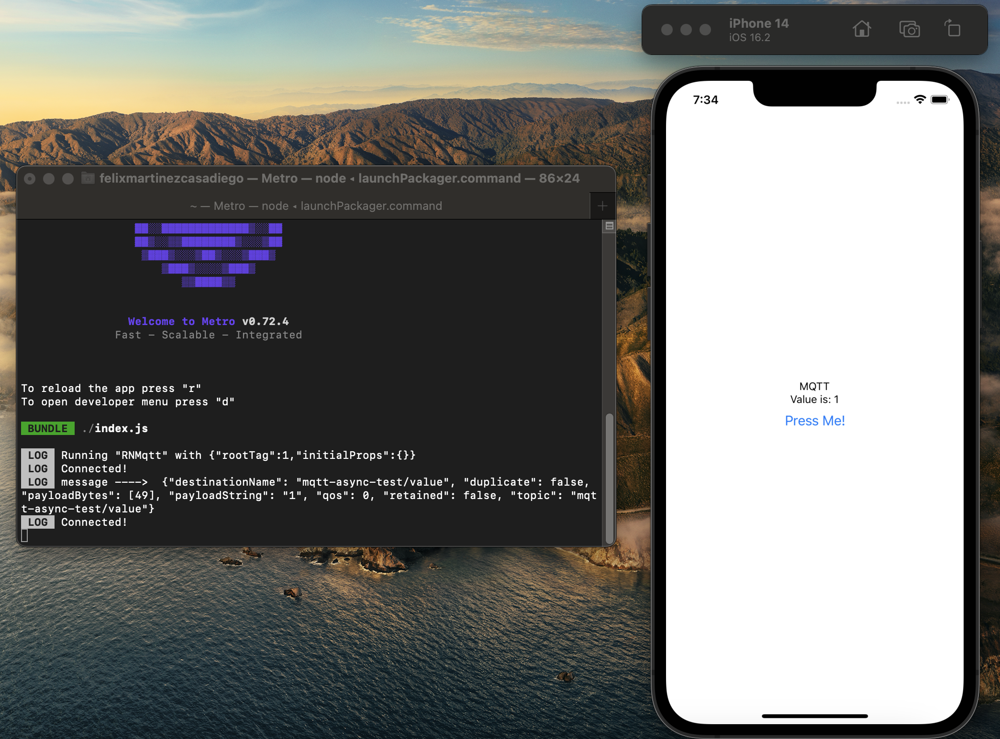

# React Native MQTT

This repository is about an app where does communication with the MQTT protocol.

## Description

I used for the creation React Native with Typescript and paho-mqtt.

React Native Version: v0.70.10

Node Version: v18.12.1

Yarn Version: 1.22.19

## Screenshots

